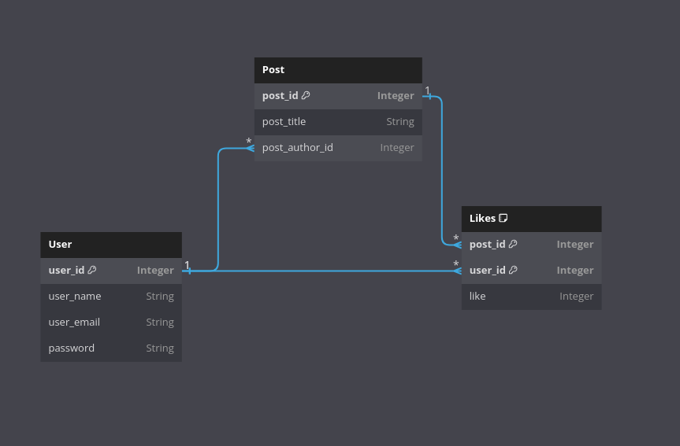

# nextjs-prisma-opinion-rater

In this project I'll try to make a web site that
has user login signup functionality, and once
the user is loged in they can create and rate
opinions.

This project will also be my first attempt at working
with [Material UI](https://mui.com/).

Form validation was done using [React-Hook-Form](https://www.react-hook-form.com/), [React-Hook-Form-Resolvers](https://github.com/react-hook-form/resolvers) and [yup](https://github.com/jquense/yup) 

Page icon is taken from [SVGRepo](https://www.svgrepo.com/)

Project's database will be [Postgres](https://www.postgresql.org/) with [Prisma](https://www.prisma.io/) as the ORM.

The database schema should look something like this

Fair warning, this was my first time translating a schema like this into prisma code so the accuracy might be off

Inside the info folder there's a txt file which can be used to get this same schema from [DBDiagram](https://dbdiagram.io/home)